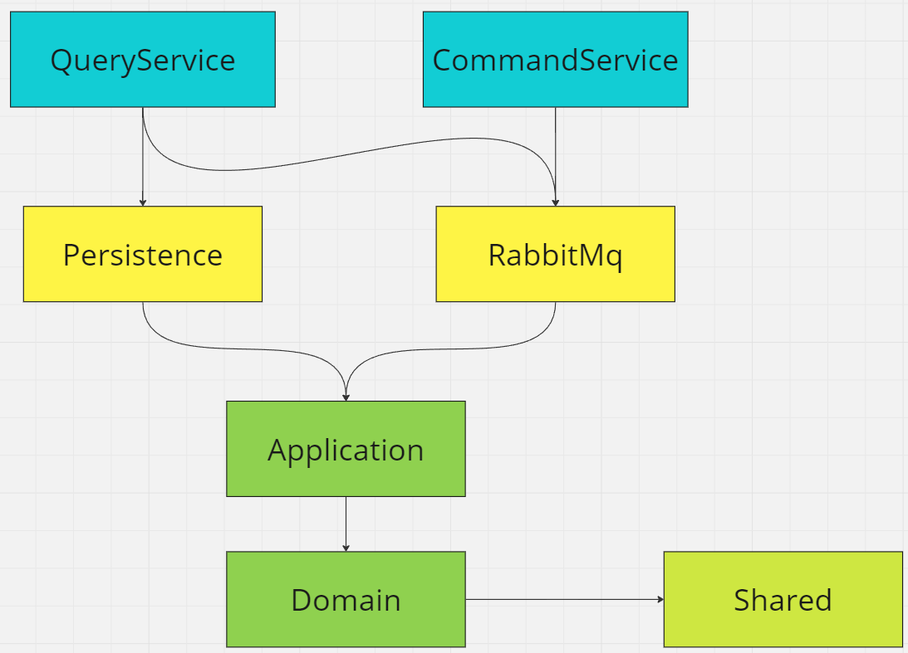

# intellexi-trailracing

## Prerequisite
- .NET 8 SDK for backend solution https://dotnet.microsoft.com/en-us/download/dotnet/8.0
- Node.js minimum v18.13 for frontend solution https://nodejs.org/en/download/package-manager
- Docker engine https://docs.docker.com/engine/install/

## Backend solution

Solution is designed following the Hexagonal Architecture principles (aka Clean Architecture). It consists of Core, Adapters and Hosts projects:

### Core
- Domain : defines entities, enums, etc.
- Application : defines business logic encapsulated in a Mediator handlers, common services and exceptions

### Adapters
- Persistence : Data Access Layer, contains Entity Framework DB context and migrations
- RabbitMq : communicates with the RabbitMq message broker instance

### Hosts
- CommandService : ASP.NET Core Web Api exposing endpoints for data manipulation
- Application : ASP.NET Core Web Api exposing endpoints for data retrieval, consumes messages in a background from the RabbitMq message broker instance

## Frontend solution

Angular v17 application developed in conjuction with Angular Material.

## How-to-use

Install **make cli** in an elevated shell (administrator privileges) in order to successfully run make commands:
- Windows: `choco install make`
- Linux: `sudo apt update && sudo apt install make`
- MacOS: `brew install make`

List of available make commands:

- `make apply-migrations` : applies database migrations against the local database container

- `make up` : starts all services defined in the docker-compose.yml file

- `make down` : stops all running services defined in the docker-compose.yml file

- `make test-integration` : runs the integration tests for the backend services

- `make test-unit` : runs the unit tests for the backend services

## TBD
- Authorization (Identity API should be developed with backing Identity DBContext or Keycloak instance)
- Logging
- Proper RabbitMq consumer exception handling
- Proper CommandService endpoint exception handling. Since CommandService does not communicate with a database, end user doesn't know if the modified resource even exists
- Frontend race creation and complete application management as well as improved design